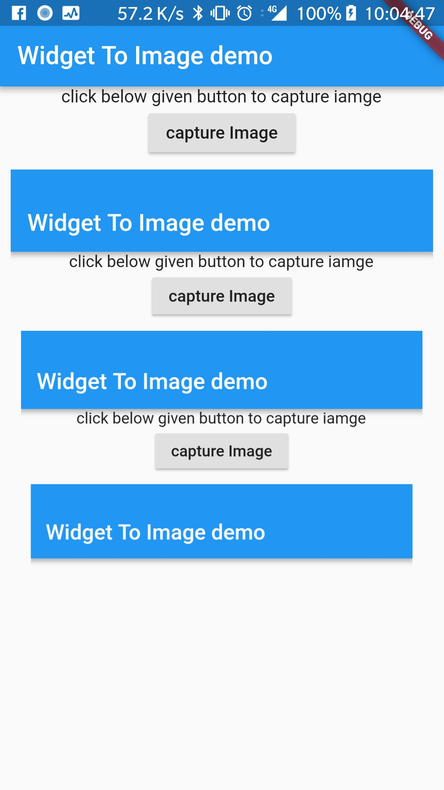

# flutter_widget_to_image

Using `RepaintBoundary.toImage` to save a screenshot of any Widget
or the whole app as PNG.

More details in the [article](https://medium.com/flutter-community/export-your-widget-to-image-with-flutter-dc7ecfa6bafb).

